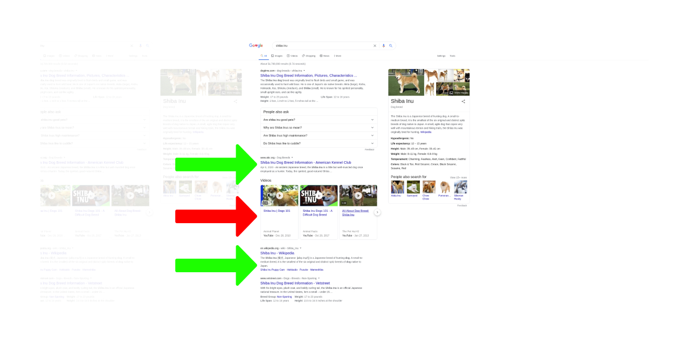

# Centered pages again!

Google Chrome extension.
Useful for FHD+ screens.

## How to...?

1. download zip
2. follow this tutorial: [How to load Chrome extension](https://webkul.com/blog/how-to-install-the-unpacked-extension-in-chrome/)

## Resolving

- Google Search
- Google Images
- Github